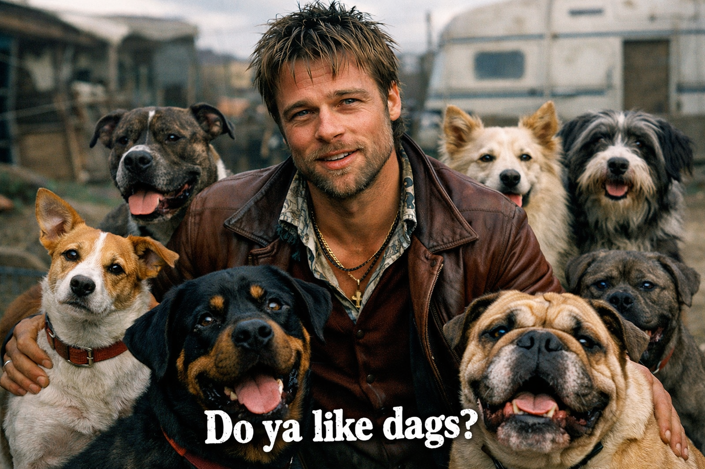

# yalikedags



> "Ya like dags?"
> "Dags?"
> "Dags. Ya like dags?"
> "Oh, dogs. Sure, I like dags. I like caravans more."
>
> Mickey O'Neil, *Snatch* (2000). This tool is about the other kind.

Full snapshot exports contain project text and people in plaintext. For a reduced copy, select **Import/Export → Export content → Structure only**, or use `render --redact` / `sync --redact`. Graph shape and task counts remain identifying; see [export contents and retention](SECURITY.md#export-contents-and-retention).

The viewer has direct page URLs such as `/dependencies` and `/tasks` (offline
exports use `#/dependencies` and `#/tasks`). Sparse graphs open at readable scale,
with independently packed components and a separate unconnected-card grid. Capture
time, source refresh, and task/edge counts stay visible. No recorded blockers is
not proof of independence: the viewer flags incomplete dependency review and
separates explicit tracking containers from its dependency frontier.

## What this is for

Right. So you've got a Linear project, yeah? Two hundred-odd cards, all sat there like they're waiting for a fight what's never gonna happen. And nobody can tell ya which one comes first, which one's holding up the rest, or which ones are the same job wearing two hats. That's what this is for. yalikedags reads your Linear project, builds the dependency DAG out of it, tells ya what's ready, what's blocked, where the long chain is, and which cards are talking rubbish. Then it draws the whole thing so ya can look at it proper. Two ways an' all: the graph, for how it all hangs together, and the grid, workstreams down the side and waves across the top, for who could be doing what this round.

### Put dependencies back in Linear

Now, if the dependencies live in a file on your machine and not in Linear where everyone can see 'em, that's no good to anybody, is it. So there's a write path an' all: it works out the difference, writes ya a plan, and ya read the plan. Nothing moves till ya say `--confirm`. Then it does the job and goes back and checks the job got done. Every other command in here touches nothing. Read only, like a good dag on a lead.

### One project, the whole team

It's for the whole team. Everyone's got their own Linear key in their own keychain, everyone points it at the same project, everyone sees the same graph. Linear is the source of truth; this just has the good sense to draw it.

Missing a Linear key? `serve --project example-project` opens a setup screen with environment/keychain instructions and a local-file alternative. Restart from the same terminal after exporting a key.

The DAG and puppy use locally bundled GSAP for hover motion, expanding click/theme pulses, and smooth selection navigation. The puppy curls its tail when seated, occasionally moves its ears and head, follows nearby pointers within a safe angle, and barks silently on click. Reduced-motion preferences disable decorative effects. Task details opens at its maximum width unless you have saved a smaller size.

**Theme → Text size** adjusts a relative-scale slider; the wider desktop navigation grows with the text.

The navigation's [DAG puppy](assets/puppy-dag.svg) is inline SVG: it follows the selected theme and travels with offline exports.

### Share it as an offline file

And when ya want someone else to see it who hasn't got the tool, or the key, or the first idea what a terminal is: `render --format html --out dag.html`. One file. Whole viewer in it, graph and all. Opens by double-clicking, asks the internet for nothing, works on a plane. Send it to whoever ya like.

JSON exports use snapshot schema 2 to preserve unknown statuses and exact estimates. Legacy schema 1 snapshots remain readable; see [the snapshot reference](docs/reference/snapshot.md).

### Find the next move

The viewer opens with the work that's ready, what it'll unblock, and the longest chain standing between ya and done. Dependencies gives the graph room to breathe; Waves shows what could run in parallel; Tasks gives ya the searchable, sortable list. Pick a task and its details open beside it. Findings calls out the dodgy cards, and Import/Export handles snapshots and comparisons. Six views, one job at a time. No arranging windows before ya can get to work. The browser does the drawing; the server hands it the analyzed data as JSON. Linear reads show the workspace and who captured it, and assigned cards say who owns the job. Still one offline file when ya export it. Filter the graph to your tasks, click a whole table row to inspect it, and drag the details drawer wider when ya need room. Theme and text size live at the bottom of the nav; [the viewer reference](docs/reference/viewer.md) covers the controls.

## Start here

Get a graph on screen in about two minutes, off the bundled example, no key needed: [See your first DAG](docs/tutorials/first-dag.md).

## Common jobs

- [Store your Linear key in the keychain](docs/how-to/store-the-linear-key.md) (once, then forget it)
- [Sync a Linear project to a snapshot](docs/how-to/sync-a-project.md)
- [Audit a project for missing dependencies and cards that want splitting](docs/how-to/audit-a-project.md)
- [Open the local viewer](docs/how-to/open-the-viewer.md), or write it out as one file ya can send someone
- [Reconcile a graph into Linear](docs/how-to/reconcile-into-linear.md), which is the one thing here that writes

## Look things up

- [CLI commands and options](docs/reference/cli.md)
- [Exit codes](docs/reference/exit-codes.md)
- [The snapshot JSON](docs/reference/snapshot.md)
- [The plan and receipt JSON](docs/reference/plan.md)
- [The viewer's screen and controls](docs/reference/viewer.md)

## Understand it

- [One issue, one independently mergeable PR](docs/explanation/atomic-work.md): the planning and task-splitting contract

- [How the frontier, the workstreams and the critical path are derived](docs/explanation/derived-views.md)
- [What Linear owns and what this tool derives](docs/explanation/source-of-truth.md)

## When it goes wrong

- [Troubleshooting](docs/troubleshooting/index.md): the sync refused, the graph has a cycle, a relation points somewhere odd

## What ya need

- [bun](https://bun.sh) 1.2 or newer. That's the runtime. There is no Python in here; the Python that used to be here is in the first commit if ya want to look at it, but ya don't.
- A Linear personal API key, stored once in your OS keychain through [`@git-stunts/vault`](https://github.com/git-stunts/vault). Or `LINEAR_API_KEY` in the environment if ya must.
- GraphViz `dot` only if ya want to render the `.dot` output yourself. The built-in SVG and the viewer need nothing.

### Try the bundled example

```bash
bun install
bun src/cli.ts render --tasklist examples/example-tasklist.txt
```

Expected output, abridged:

```text
loaded 12 tasks from task list examples/example-tasklist.txt
task list examples/example-tasklist.txt, as of <today>: 12 tasks (2 done, 2 ready, 7 blocked, 1 in-progress)

frontier (2 ready tasks, most urgent first):
  implement-core-dag-builder  Implement core DAG builder  immediately-unblocks:2  downstream-impact:7
  write-documentation  Write documentation  immediately-unblocks:1  downstream-impact:2
...
critical path by depth: 6 tasks: implement-core-dag-builder then ... then deploy-to-production
```

## For them what want to change it

Ports and adapters, TypeScript on bun, tests first, standards before code. There's a live test tier an' all, with its own fixture and its own token, fenced off so it can't wander into anything real: [live testing](docs/contributing/live-testing.md). Read these in order and don't skip: [docs/standards/typescript.md](docs/standards/typescript.md), [docs/standards/testing.md](docs/standards/testing.md), [docs/standards/documentation.md](docs/standards/documentation.md). Then [the contributor guide](docs/contributing/architecture.md) and [CONTRIBUTING.md](CONTRIBUTING.md). Run `bun run check` before ya push or the hooks'll have ya.

## Licence

Apache 2.0. See [LICENSE](LICENSE) and [NOTICE](NOTICE). Dag not included.
