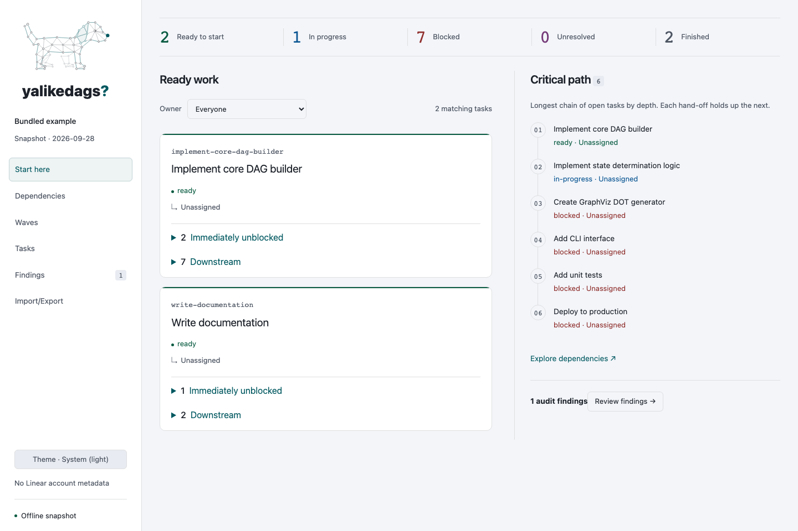
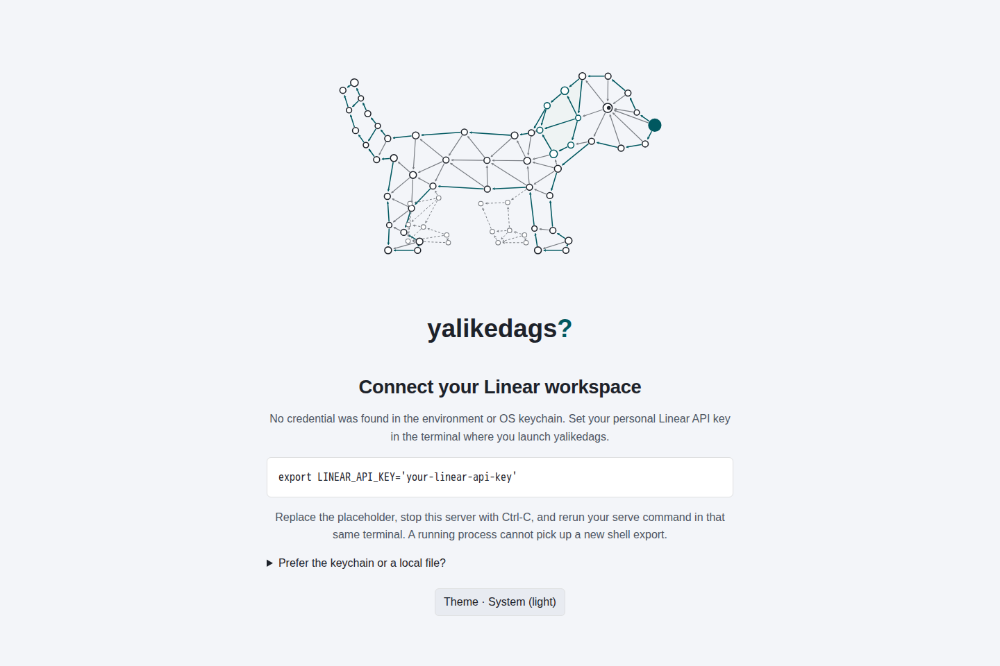
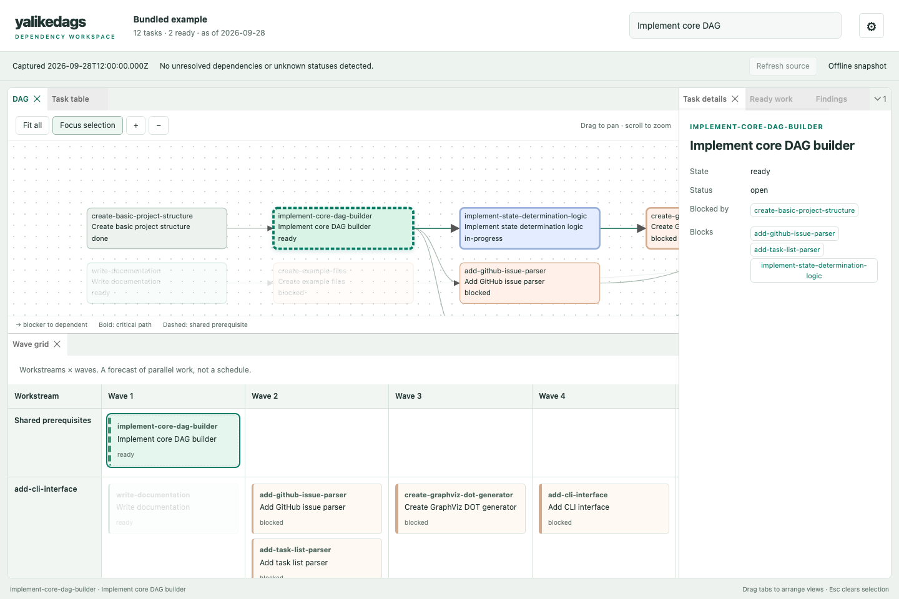
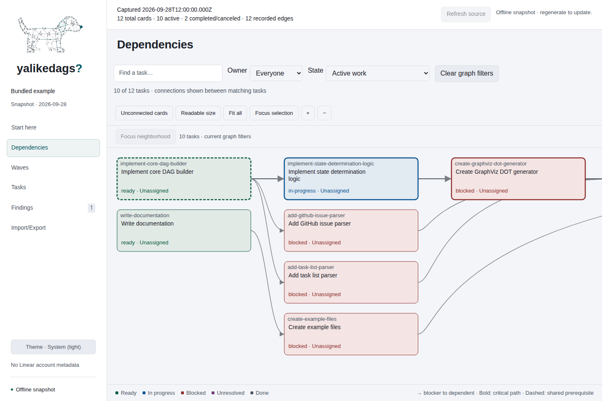
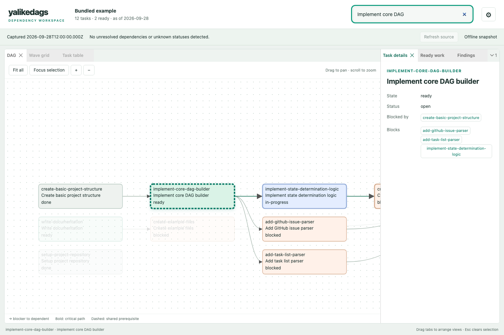
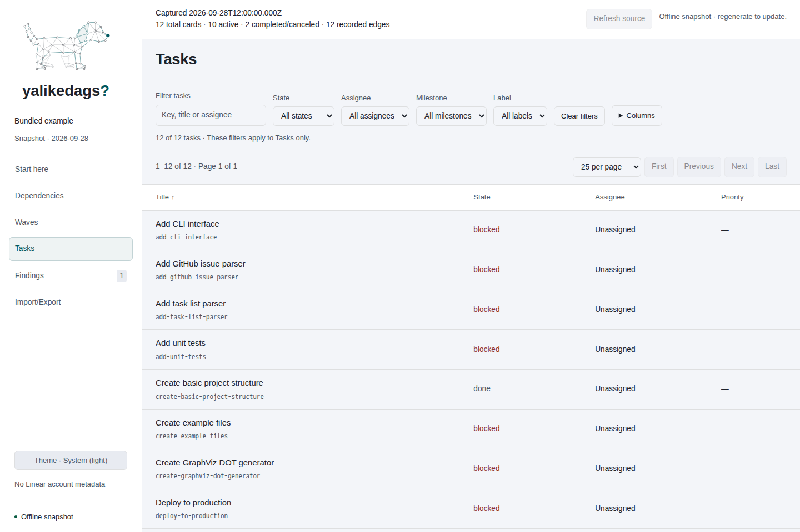

# The viewer

## Open a workspace

`serve` hosts the viewer on `127.0.0.1`. `render --format html --out dag.html` writes the same workspace as one self-contained file. The browser renders all views and the SVG graph. The local server delivers a minimal HTML shell, then `/viewer.json` supplies the analyzed project data and refresh/comparison metadata. No external assets are fetched. Offline HTML embeds that same JSON payload alongside the client code and styles, and opens without a key, running server, or network request.

## Record a dependency review

On **Start here**, choose **Review dependencies**. Supply a reviewer name and the evidence you inspected in **Review basis**. Under **Recorded relationship decisions**, accept, reject, or leave each recorded prerequisite unreviewed; rejection requires a note. Add missing evidence and obligations under **Unresolved exceptions**, then choose **Record review**. This reviews the whole captured task scope, including recorded relationships; it does not discover edges, edit the graph, or write to Linear.

The overview distinguishes unreviewed, reviewed for this source version, reviewed with exceptions, and stale. Source warnings and structural uncertainty recomputed from captured task facts are retained as exceptions even when the free-text box, imported claim, or embedded derived metadata lists none. The status and visible exception count combine declared exceptions with uncertainty observed in the current capture. Rejected recorded relationships and unreviewed recorded or candidate relationships prevent a claim of complete coverage. Recorded edges without a decision appear individually as unreviewed and contribute to the unresolved relationship count; imported decisions outside the captured relationships and discovered candidates are identified as exceptions. An explicit completed review only records what was checked; it cannot prove that no dependency was missed.

The source version is SHA-256 over task IDs, keys, titles, descriptions, statuses, blocker relationships, parent/child relationships, labels, source warnings, and available workspace/project identity. New or removed tasks and changes to these fields make previous decisions historical. Task ordering, capture time, display names, assignments, priorities, and estimates do not change this prerequisite-evidence identity. External evidence not captured in these fields must be rechecked manually; a URL alone does not monitor a remote document.

Review records stay in this browser and source context until **Clear local review** or site-data removal. Storage failures are visible; export before leaving if saving failed. Full JSON and HTML exports, and served viewer payloads, enforce the combined snapshot and review import budgets after derived fields are added. If the combined file is too large or structurally complex, export reports the limit and retains the review in the page; keep the page open and copy the evidence before leaving instead of relying on a recovery download. **Import/Export → Export snapshot JSON** includes the current review in full exports and omits it from structure-only exports. Reopen an exported JSON with `--snapshot`, or render it as HTML, to carry its review evidence forward. Imported records are labeled self-reported claims, never authenticated reviewer identity; a local record for the same source takes precedence and is labeled separately. Clearing a local record reveals any embedded claim without deleting the source file. Offline views compare the review against the embedded capture and cannot establish whether live Linear has changed.



The viewer embeds a hash-based script policy. Offline files permit no connections; served pages use same-origin JSON. Theme and SVG inline styles remain supported. The local server additionally denies embedding in frames.

The local server validates its host and port before serving data. Use the printed `127.0.0.1` URL or `localhost` with the same port; custom hostnames and reverse proxies are not supported. Data routes accept GET/HEAD; refresh requires a same-origin POST.

## Connect Linear

When `serve --project` cannot find a credential in either the environment or OS keychain, or Linear rejects it, the viewer shows a full-height setup screen with the DAG puppy and a command for the configured key target. The command is shown as escaped code; no key is entered, stored, or sent through the browser. Keychain targets that are not valid shell variable names get a keychain command instead of an invalid `export`.

Replace the placeholder with your personal Linear key, stop the server with Ctrl-C, and rerun the original command from that shell. For example:

```bash
export LINEAR_API_KEY='your-linear-api-key'
bun src/cli.ts serve --project example-project
```

Expand **Prefer the keychain or a local file?** for a command that reads the key from stdin without adding it to shell history, or to explore the bundled example without authentication. Source-checkout commands use `bun src/cli.ts`; packaged installations can substitute `yalikedags`. A valid stored key still opens the workspace even if no environment variable is set. Theme and text-size controls also work on the setup screen.

Project export endpoints return 503 until a snapshot is loaded. Unrelated source failures retain their normal CLI errors; a failed refresh of a previously loaded project preserves that snapshot.



## Motion and selection

The viewer bundles GSAP with its own client assets, including offline HTML; animation makes no CDN or service requests. Hover or keyboard-focus a graph node to give it a short wiggle. Click the DAG or puppy to release an expanding circle from the pointer. Nodes react when the ring reaches their visible bounds. Theme changes smoothly interpolate semantic colors and emit a wave from each visible graph’s center. The raw standalone SVG remains static.

Only one wave per graph runs at a time, with at most 180 visible nodes animated per wave. A new pulse replaces the old one. Panning never fires a click pulse; dragging, wheel zoom, graph replacement, and hiding the browser tab cancel decorative motion. Task graph layout transforms and dependency edges stay fixed. Theme transitions release their temporary overrides when done, so CSS theme tokens remain authoritative.

Selection is shared across views. Selecting a task centers it smoothly in Dependencies, without resetting a valid zoom level. Switching to Tasks, Start here, or Waves reveals its page and scrolls to the selected row/card. Existing filters stay active: excluded tasks are not silently added back. Keyboard focus stays where you put it; wheel, pointer, and keyboard input cancel automatic scrolling. Task details opens with a short fade.

Hover the puppy, focus its brand link, or change themes to play a short tail wag. Use **Sit and stand** in the development Puppy rig tool to play a five-keyframe sit: shift weight, lower onto rounded haunches with its head over its forelegs, adjust the front paws one at a time, hold, and stand again. Body poses and tail wags have independent GSAP tracks, so a wag can continue through a sit. Its duration uses --motion-sit-duration. Reusable node-offset keyframe packets run on a GSAP timeline with smooth interpolation; the tail’s arrows follow its nodes. Replacement clips start from the current layer positions. The sit sequence returns to standing; reduced-motion/visibility cancellation resets the whole rig. Tail tracks compose with decorative node wiggles. Duration and swing use --motion-tail-duration and --motion-tail-angle.

In development mode, open the floating **Developer tools → Puppy rig** tool and choose **Colored regions** or **Regions and bones**. The preference stays in this browser. Region colors fill the nodes and translucent triangle surfaces behind the DAG edges. Mesh vertices follow their rig nodes through every animation; switching debug off restores the original unfilled artwork. Fill opacity and triangle seams use --rig-mesh-* tokens. Region colors use theme tokens; labeled swatches and distinct bone dash patterns also identify the regions in monochrome themes. The overlay covers the frame, head, ears, tail, forelimbs, and hindlegs.

With the rig overlay enabled, **Puppy pose** holds Standing, Sitting, or Play bow. Moving from a sit to a bow raises the hips before lowering the chest. **Wag tail**, **Tilt head**, and **Shake ears** run independently over any pose. Head rotation carries the ears, and tail rotation follows its moving root. Each near/far leg has its own base track; paw positions belong to the posture and are not moved by head or tail actions. The legs use two-bone inverse kinematics with fixed bind lengths and bend direction. Far forelimb surfaces connect fully to the shoulder; far hindlimbs have distinct ankle, hock, and paw contours. Bound outline vertices rotate with their bones without scaling across the limb; the outer haunch blends pelvis and leg influences to preserve its round silhouette. Feet and the torso remain authored pose controls, not a physics simulation. The DAG's connectivity does not change. No debug setting changes project data.

The operating system’s **Reduce motion** setting is honored live: waves, wiggles, and tail clips stop, theme colors switch immediately, and selection scrolling/panning becomes immediate. Motion duration, wave speed, amplitude, opacity, and color use CSS tokens in component-tokens.css (--motion-*). Browser evidence lives in e2e/motion.pw.ts.

## Developer overlay

Start the local viewer with an explicit development flag:

```bash
YALIKEDAGS_DEV=1 bun src/cli.ts serve --tasklist examples/example-tasklist.txt --port 4178
```

The floating **DEV** toolbar appears on both the project and credential setup screens. It is absent from normal servers and HTML exports. URL parameters, imported project data, and saved rig preferences do not enable it. Restart the server without the environment flag to disable development mode.

Drag the **DEV** grip with a mouse, pen, or touch. GSAP Draggable keeps it within the viewport. Focus the grip and use arrow keys to move it; hold Shift for larger steps. Position is saved locally when storage is available and clamped when the viewport or panel size changes. Collapse leaves the toolbar accessible; expand restores its widgets and output.

The icon row selects **Diagnostics** or **Puppy rig**. Tool widgets appear below it, followed by a selectable, read-only diagnostics text area. **Clear diagnostics** empties the log. The log holds at most 100 local UI events; it does not intercept console arguments or collect project text, credentials, raw errors, or network responses. Browser failures are noted with a prompt to inspect the browser console. Diagnostics widgets show viewport dimensions, pixel ratio, motion preference, and puppy node count. Rig controls are available only here, rather than in ordinary Appearance. The pose selector and Wag tail, Tilt head, and Shake ears buttons remain available when rig visualization is Off; only the region legend and geometry overlays are hidden.

The development flag controls presentation, not authentication. All tools run locally in the browser; GSAP and its Draggable plugin are bundled without CDN requests.

## Rendering and data

The server computes task states, frontier order, unblocking counts, waves, workstreams, critical paths, audit findings, and resource conflicts. The browser decodes those results and builds the interface; it does not rerun scheduling to draw the views. Graph positioning is a client rendering step. Comparing a locally chosen JSON file remains entirely client-side. `/snapshot.json` is the portable snapshot export; `/viewer.json` wraps it in schema `yalikedags/viewer/1` with refresh capability and optional changes. Neither endpoint writes a JSON file to disk. Use `sync --out` or `render --format json --out` to save one.

## Linear account and assignments

For a fresh Linear read, the navigation rail and **Snapshot details** show the workspace, project, and user who captured the data. These are capture metadata, not a claim that the person opening an export is signed in. Older snapshots and file sources without this metadata say so. Credentials and email addresses are not included.

Ready cards, wave cards, critical-path steps, graph nodes, the task table, and the inspector show assignment names. Missing assignment displays **Unassigned**. The existing Tasks assignee filter includes an Unassigned option. Long assignee names can be shortened in graph labels; the full name is available in the node tooltip and inspector. Refresh the source to see assignment changes; the viewer never assigns or reassigns issues.

## Start with the next move

The first visit opens **Start here**. The summary counts tasks with no recorded open blockers, in-progress, blocked, unresolved, and finished tasks separately. The dependency frontier is ranked by urgency and excludes explicitly identified tracking containers. This does not establish implementation readiness. Click **Immediately unblocked** or **Downstream** on a card to expand the exact task list; each result opens its details. Immediate results have no recorded open blockers when that card finishes; downstream results include unfinished descendants that may still have other blockers. Resource warnings include in-progress holders and ready contenders.

The critical path lists the longest chain of open tasks by depth, in dependency order. Select any step to inspect it. This is a dependency forecast, not a duration estimate or calendar schedule. The graph's bold borders include both depth-based and effort-based critical chains.

## Views

Each workspace view displays its name as a visible H1 above its content. The heading follows navigation and uses the shared responsive gutter and theme typography tokens.

The navigation brand includes an inline DAG puppy above the wordmark (beside it on mobile). Its colors follow the active theme; the same artwork is embedded in offline exports without a separate asset request.

The navigation rail switches the main working area between six views. On narrow screens it becomes a horizontally scrollable navigation bar.

| View | Use it to |
|---|---|
| **Start here** | Inspect the recorded dependency frontier, its impact, and the longest open chain. |
| **Dependencies** | Trace blockers and dependents. Arrows point from blocker to dependent. **Readable size** restores a readable scale; **Fit all** shows the complete graph. |
| **Waves** | Compare workstreams across waves. Shared prerequisites appear first. Columns retain their width and scroll horizontally. |
| **Tasks** | Search, sort, and filter by state, assignee, milestone, or label. Filters apply only to Tasks. Click anywhere on a row to open details; the column chooser remembers optional columns. |
| **Findings** | Review audit findings, supporting details, and evidence that would invalidate them. |
| **Import/Export** | Inspect and refresh the source, export snapshot JSON, or compare an earlier snapshot locally. |

Only one main view is shown at a time. The active view is remembered when browser storage is available. Invalid or unavailable storage falls back to Start here. Old Dockview layouts are ignored; docking, split panes, and pop-out windows have been removed.

A wave is a forecast of parallel work, not a deadline or scheduling barrier. Tasks with unknown statuses, unresolved external blockers, cycles, or dependencies on such work appear under **Outside the wave forecast**. Workstreams use titles and wave headings include task counts. An external blocker is a task outside the loaded project whose status cannot be established here.



## Pagination

Ready work, Tasks, wave workstream rows, unscheduled tasks, and each findings/change/impact group use client-side pagination. The default is 25 items, with 10, 25, 50, or 100 per page and First/Previous/Next/Last controls. The range and page count describe the filtered results. Lists of ten or fewer omit unnecessary controls.

Task filters and sorting operate across the full dataset before paging. Owner filters reset Ready work and Waves to page one. Each view has independent paging; changing pages preserves task selection. Page sizes and positions last for the current view session and reset on reload. Wave column counts remain project-wide. The dependency graph is not paginated; use graph filters or neighborhood focus to narrow it.

## Find and inspect a task

1. Open **Dependencies** and enter a key, title, or assignee in **Find a task**.
2. Choose a result, or press Enter for the first match. Arrow Down moves focus into the results.
3. Dependencies opens, centers the task, and opens its details.
4. Follow clickable blockers and dependents, or switch views to inspect the same selection.
5. Use **Close task details** or Escape to clear selection and reclaim the space.

The left navigation stays visible. The **Task details** edge button hides or restores the drawer while retaining selection. Its single **Close task details** button clears selection. Drag the drawer's left edge to resize it, or focus that edge and use arrow keys; its width survives reloads. Without a saved width it opens at its maximum (900 px, bounded by the viewport), and you can still drag it smaller. On smaller screens the inspector overlays the working area. Content scrollbars are hidden while scrolling remains available.

Search displays up to 30 results and tells you when to narrow the query. Task descriptions render sanitized GitHub-flavored Markdown, including lists, tables, code, and disabled checkboxes. Description images become links rather than fetching external assets. Valid links open in a new tab.

Before selection, the graph has the whole working area:



After selecting the DAG builder, its dependency chain and details are visible:



Dependencies has independent owner filters (**Everyone**, **My tasks**, **Unassigned**) and state filters, including **Open** for unfinished tasks. My tasks uses the captured account's stable user id. Filtering redraws matching nodes and their connecting edges client-side. Selecting a search result outside the filters clears them to reveal it. **Readable size** centers the selected node. Zoom is bounded between 200% and 25%, allowing a wider fit when needed to show the entire graph.

## Controls and visual cues

| Action | Control |
|---|---|
| switch view | navigation rail |
| pan | drag inside the graph |
| zoom | mouse wheel, or **+** / **−** |
| show the whole graph | **Fit all** |
| return to readable node sizes | **Readable size** |
| center the selected task | **Focus selection** |
| select a task | click a node, card, path step, or task key; keyboard users can press Enter or Space |
| close details and clear selection | **Close task details**, or Escape |
| inspect freshness, refresh, or export JSON | **Import/Export** |

The graphite surfaces use cyan for navigation and selection. Task states use mint (ready), blue (in progress), coral (blocked), pink (unresolved), and slate (done). State names remain visible as text. A bold graph border marks critical-chain membership; a dashed border marks a shared prerequisite. Unrelated edges recede on selection while task labels stay readable. The table uses colored state text rather than full-row state fills.



## Freshness, comparison, and errors

**Import/Export → Export snapshot JSON** downloads the current snapshot as `yalikedags-snapshot.json`, including task descriptions and captured account metadata. This works in offline HTML too. Importing an earlier JSON file compares it with the current project; it does not replace the current project or write to Linear.

**Import/Export → Snapshot details** shows the exact capture timestamp, or **Capture time unknown** for legacy snapshots. Partial-analysis details identify missing blocker references, unknown statuses, cycles, and source warnings. Reading a snapshot file preserves its original capture time.

**Import/Export → Refresh source** explicitly rereads through the local server. There is no polling. Selection, filters, sorting, and active view survive a successful refresh; failed reads preserve the current snapshot and display a notice. Offline exports disable refresh. A refresh of a snapshot file rereads that file, not its original tracker.

Snapshot comparison runs in an embedded local worker, including in offline HTML. Files above 8 MiB are refused before reading; [snapshot import budgets](snapshot.md#import-budgets) also bound graph and JSON structure. **Cancel comparison** terminates work, and a 15-second timeout stops expensive comparisons. A newer selection cancels the previous request. Failure or cancellation leaves the current project intact and clears incomplete comparison results.

**Import/Export** reports added and removed tasks, completed tasks, status changes, assignment changes, blocker changes, and changes in critical-chain membership. After refresh it compares the previous successful read and confirms when no changes were found. **Compare snapshot JSON** compares a chosen earlier file locally. It uses stable task ids, so files from unrelated projects can give misleading results. It is not a complete field-by-field audit.

Empty snapshots, unschedulable waves, no ready work, and no audit findings have explicit empty states. Invalid embedded data produces a visible startup error. Local storage holds the active view, column preferences, inspector width, and appearance preferences; a refresh handoff temporarily uses browser history state for selection and controls. Ordinary reload resets selection.

## Ownership, graph neighborhoods, and findings

Start here and Waves have independent owner filters, including **Unassigned** and **My work (snapshot account)**. My work compares stable Linear user ids, not display names, and is unavailable when identity metadata is missing. Account and capture information are available in Import/Export on mobile. An incomplete-analysis notice distinguishes uncertainty from ordinary blocked work.

Select a graph task, then **Focus neighborhood** to lay out its immediate blockers and dependents. **Expand one hop** reveals more connections; **Whole project** restores the previous viewport within the current graph filters. Switching views preserves zoom. Inspector dependency links reveal and center the graph; closing details returns focus to the originating control when it remains available.

Findings separate structural problems from suggestions and group them by kind. **Inspect affected chain** opens a focused neighborhood. Changes group events by type, including reassignment, and show before/current capture provenance when available.

## CSS themes

The interface is custom HTML, CSS, and TypeScript, without a component framework. Styling uses three token levels:

- `src/viewer/browser/theme.css`: reference palette, semantic roles (canvas, surface, ink, accent, task states), shared typography, spacing, sizes, and effects.
- `src/viewer/browser/component-tokens.css`: named component defaults for every visual declaration, including responsive variants and graph styles.
- `src/viewer/browser/viewer.css`: selectors consume tokens; locally inherited task colors resolve at the component.

The default text scale is 100% of your browser’s default font size. **Theme → Text size** is a slider from 87.5% to 150%, updating immediately; arrow keys adjust it and Home/End select the limits. **Reset text size** returns to 100%. Typography and desktop navigation width use relative units, so both grow together. The desktop rail starts at 16 rem (14.5 rem on narrower desktop windows); mobile navigation stays full-width and scrolls horizontally. The choice is saved locally, and previous 14/16/18/20 px preferences migrate to the equivalent relative scale. Introductory slogans, navigation numbering, repeated view subtitles, and idle footer instructions have been removed. Task data, uncertainty explanations, and operational controls remain.

Use the **Theme** button at the bottom of the left navigation to choose a palette independently of **Light**, **Dark**, or **System** display mode. System is the default and follows operating-system changes immediately. Preferences stay in browser storage; selections still work for the current session when storage is unavailable. The same controls work in offline HTML and on mobile. Escape closes the appearance panel and returns focus to its button.

Graphite pairs `themes/light.css` with `themes/dark.css`. Palm (`themes/palm.css`) preserves the supplied Carbon Black `#1b2021`, Ebony `#51513d`, Palm Leaf `#a6a867`, Vanilla Custard `#e3dc95`, and Sand Dune `#e3dcc2` anchors. Its dark mode uses Carbon Black surfaces, Sand Dune text, Custard accents, and Palm Leaf readiness. Its light mode reverses the luminance hierarchy and derives darker readable accents. OKLab mixes derive intermediate surfaces; blue, coral, and pink retain the other task-state meanings.

The HTML element records the palette as `data-palette`, the preference as `data-mode`, and the resolved light/dark mode as `data-theme`. To ship another theme, import its stylesheet after the token defaults in viewer.css, register its option in ThemeCatalog, and rebuild with `bun run build:viewer`. Offline exports embed the compiled styles too.

Available palettes include Graphite, Palm, Tomorrow Night Eighties, Solarized, Dracula, Monokai, Gruvbox, Tokyo Night, and Monotone. All support Light, Dark, and System. Monotone is neutral grayscale; written state labels remain visible. Each palette has a separate CSS file; the shared catalog drives both the picker and contrast-test coverage.

These are viewer adaptations, not exact editor-theme ports. Original palette anchors stay in reference tokens. Semantic text colors use bounded OKLCH lightness (and reduced red chroma where needed) to maintain 4.5:1 contrast on panels and tinted graph cards. Light Dracula and Monokai are custom companions; Tomorrow Night Eighties pairs with Tomorrow's light palette.

Palette sources:

- [Tomorrow by Chris Kempson](https://github.com/chriskempson/tomorrow-theme)
- [Solarized by Ethan Schoonover](https://ethanschoonover.com/solarized/)
- [Dracula specification](https://draculatheme.com/spec)
- [Monokai palette in VS Code](https://github.com/microsoft/vscode/blob/main/extensions/theme-monokai/themes/monokai-color-theme.json)
- [Gruvbox by morhetz](https://github.com/morhetz/gruvbox)
- [Tokyo Night palette](https://github.com/tokyo-night/tokyo-night-vscode-theme)

For example, a theme can override these values without rewriting component selectors:

```css
:root {
  --accent: oklch(82% .12 195);
  --font-sans: system-ui, sans-serif;
  --space-unit: 1px;
  --ui-button-border-radius: 10px;
  --ui-button-padding: 10px 16px;
  --ui-graph-node-gatekeeper-dash: 8 4;
}
```

Colors, type, spacing, borders, radii, shadows, opacity, component dimensions, and SVG paint styles have token hooks. Browser tests check text contrast for dark and light themes and verify that overrides reach controls, cards, and SVG nodes. Accessibility hiding rules remain fixed; responsive breakpoints are CSS media queries. Graph layout coordinates are computed by the renderer, not CSS presentation rules.

## Related workflows

- [Open the local viewer](../how-to/open-the-viewer.md)
- [Audit a project](../how-to/audit-a-project.md)

## Export contents and local retention

In **Import/Export**, choose **Export content** before clicking **Export snapshot JSON**. **Full snapshot** (default) includes descriptions, people, project/account details, and provenance present in the current snapshot. **Structure only** replaces identities and removes content while retaining statuses and relationships. Graph shape and counts remain identifying. See the [exact reduction](snapshot.md#structure-only-exports). Changing this choice affects only the downloaded copy, never the current workspace.

Downloads are plaintext and stay on disk until deleted. Snapshots are not automatically saved to browser storage; preferences and refresh restoration have separate retention described in [Security](../../SECURITY.md#export-contents-and-retention).

### Puppy attention and directional waves

Click the puppy for a silent bark animation: the jaw opens and the head gives two small impulses without changing its held posture. In the development Puppy rig tool, **Sit and stand** plays the original five-keyframe sequence; the pose selector holds Standing, Sitting, or Play bow. The seated tail curls low around the haunches using four articulated sections.

While visible, the puppy chooses fresh idle gestures with irregular 6–32 second pauses: variable tail wags, head turns, ear twitches, and occasional bows that return to standing. Consecutive gestures never repeat, and some wags include an ear twitch. Manually held poses suppress automatic bows. Pointer proximity, clicks, theme changes, and debug actions postpone the next idle gesture; interrupting an automatic bow blends back toward standing. A nearby mouse or pen aims its head toward the pointer with a 14-degree clamp; leaving the vicinity returns the gaze to neutral. These additive tracks preserve the body pose. Hidden pages and reduced motion suspend idle behavior, and reduced motion disables pointer tracking and barking.

Click and theme waves displace nodes away from the wave origin in screen space, including mirrored artwork and zoomed graphs. A damped spring response settles each node after the impulse. Pose animation and ripple wrappers compose independently, so a held puppy pose still responds to theme waves. Motion timing, proximity, angle limits, and spring damping/frequency use semantic motion tokens.

## Page URLs

The local viewer renders each page in the browser and exposes a stable URL:

| Page | Local route |
| --- | --- |
| Start here | `/start` |
| Dependencies | `/dependencies` |
| Waves | `/waves` |
| Tasks | `/tasks` |
| Findings | `/findings` |
| Import/Export | `/import-export` |

Direct links and page reloads return the viewer shell; the browser loads the current
server snapshot. Navigation uses browser history, including Back and Forward.
Opening `/` restores the saved view, falling back to Start here. Standalone HTML
exports use matching hash routes, such as `viewer.html#/tasks`, so navigation
continues to work without a server. Reloading a page does not fetch fresh Linear
data: use **Refresh source** to read upstream.

## Sparse graphs and planning evidence

The browser lays out weakly connected components independently and packs them into
shelves. Cards with no connections in the current view occupy a separate compact
grid. This arrangement creates no dependency edges. Filters can make a card appear
unconnected in that view even when it has a connection elsewhere in the snapshot.
Use **Unconnected cards** to jump to that region.

The opening graph uses readable card scale. **Fit all** is a deliberate overview;
**Readable size** centers the selection, or opens from the first component when nothing is selected. Filtering,
refresh, and returning from a neighborhood choose new readable bounds. Resize
recovers a view that would otherwise be empty or microscopic. **Active work** is
the default graph filter; completed/canceled history remains available separately
or together with active cards.

The capture summary shows the source capture time and whole-snapshot task/edge
counts on every page. Graph filter counts describe the displayed subset. Failed
source refresh retains the existing graph and reports its retained capture time.
Successful refresh replaces the snapshot and restores still-valid selection and
controls. Page reload only displays the server's current capture.

The incomplete dependency-review notice is intentional: no recorded blockers is
not evidence of independence or implementation readiness. Source labels and an
explicit tracking-container declaration distinguish implementation, research,
decisions, investigations, and containers; unclassified cards need disposition.
Containers are excluded from the dependency frontier count. Wave membership still
reflects the supplied graph and may include containers; it is not an executable-PR
count. Proposed dependencies require evidence and review outside this viewer and
are never manufactured from domains, shared files, or parent membership.

### Planning coverage disclosure

The Waves page exposes active scope, terminal exclusions, tracking-container counts, shared prerequisite assignees, unresolved exceptions, and cross-group edges in a bounded disclosure. These counts describe captured cards rather than executable PRs. Workstreams are temporary connected components, not team assignments; IDs and membership may change after refresh. Export the snapshot to retain the exact topology and state behind the displayed partition.

### Discover and review candidate dependencies

Choose **Discover candidate dependencies** to inspect local evidence extraction from titles and descriptions. The first implementation recognizes captured issue keys (such as `DEMO-1`). `requires`, `depends on`, `blocked by`, or `needs` immediately before a reference yields explicit prerequisite wording. Other references, including negation and reverse-direction wording, remain uncertain. Matching a theme, parent, or person never creates a candidate. Duplicate keys are ambiguous and are skipped. Unreferenced requirements remain a manual review responsibility; this is not general semantic discovery.

Interactive discovery runs in the browser without a model or remote provider. The same pure routine supplies derived candidate evidence in CLI/server snapshot exports. Task IDs are processed in canonical order, so reordering the same capture cannot change the selected candidates at the limit. It is bounded at 2,000 candidates, with quoted evidence bounded to 1,024 characters including truncation markers around the reference. Reaching the candidate ceiling prevents a complete review claim and appears as an explicit exception. Imported acceptances without an evidence and direction rationale also appear as exceptions. Excerpts identify the proposed blocker and dependent; they do not certify direction or completeness. Read the full source task before accepting.

Accept or reject each candidate and record the evidence/direction rationale. **Record review** persists these dispositions with the existing scope and evidence lifecycle. Unreviewed candidates and rejected recorded edges remain unresolved; rejecting a proposed edge is a completed disposition, not a tracker deletion. Changes to source evidence make the record stale and prevent reuse of its accepted decisions.

Under **Preview and export proposals**, choose Recorded, Proposed, or Recorded + accepted candidates. The separate preview recalculates readiness, waves, both critical paths, shared prerequisites, groups, and exceptions. The main viewer continues to show recorded source relations. Proposed includes unreviewed candidates and can contain cycles; its hypothetical label and coverage exceptions remain visible. Accepting does not write to Linear.

**Download proposal evidence** retains the source snapshot, candidate provenance, current dispositions, and accepted graph analysis in an audit bundle (`yalikedags/proposal-evidence/1`). It is an evidence document, not a tracker receipt or a snapshot import. A full ordinary snapshot retains candidate evidence and the saved review; structure-only exports omit identifying text and review claims. Unsaved form choices belong only to the evidence bundle until the review is recorded.

**Download accepted relation plan** requires a recorded current review and a captured Linear project. It exports only saved accepted additions with an evidence/direction rationale, refuses stale source or task scope, and refuses newly cyclic plans. Other unresolved candidates can remain explicit exceptions; exporting accepted additions does not claim the whole review is complete. Inspect that exact plan, then use the existing CLI:

```sh
bun src/cli.ts apply --plan yalikedags-accepted-relations.json
bun src/cli.ts apply --plan yalikedags-accepted-relations.json --confirm --receipt receipt.json
```

Use `--key-target <configured-target>` if this project uses a named keychain entry. The first command is a dry run. The second performs only the reviewed plan after checking fresh source evidence. Read the receipt: failed, stale, skipped, or unconfirmed mutations are not success. Refresh the viewer to see the actual tracker graph; accepted local proposals never silently become recorded edges. See [plan and receipt semantics](plan.md#plans-exported-from-dependency-review).
