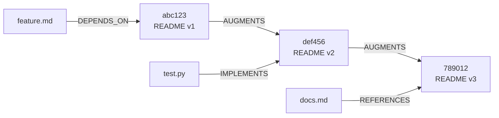

# Research: Scaling Techniques from git-mind

**Date**: 2026-01-11
**Source**: Analysis of [git-mind](https://github.com/neuroglyph/git-mind) codebase
**Goal**: Apply massive-scale techniques to yalikedags

---

## Executive Summary

git-mind is a C project that transforms Git repositories into "serverless knowledge graphs" - storing semantic relationships between files as versioned data inside Git itself. The project handles **millions of edges** with **millisecond query times** using sophisticated caching and storage techniques.

**Key insight**: git-mind treats the graph as first-class data that evolves with your codebase, using Git as both database and version control system.

---

## Core Architecture: Two-Layer Design

### Layer 0: Edge Journal (Source of Truth)

```text
refs/gitmind/edges/main       # Append-only commit chain
refs/gitmind/edges/feature-x  # Per-branch isolation
```

**How it works**:
- Each edge operation creates a Git commit with:
  - **Empty tree** (storage efficient)
  - **CBOR-encoded message** containing edge data
  - **Parent chain** preserves order
  - **Standard refs** that push/pull normally

**Edge structure** (52 bytes + paths):
```c
typedef struct {
    uint8_t  src_sha[20];     // Source blob SHA-1
    uint8_t  tgt_sha[20];     // Target blob SHA-1
    uint16_t rel_type;        // Relationship enum
    uint16_t confidence;      // IEEE-754 half float
    uint64_t timestamp;       // Unix millis
    char     src_path[256];   // Path at creation time
    char     tgt_path[256];   // For human display
} gm_edge_t;
```

**Why this matters for yalikedags**:
- Append-only storage eliminates merge conflicts
- Immutable history allows time-travel queries
- Git handles distribution and versioning for free
- Could store task state changes as append-only log

### Layer 1: Speed Cache (Optional Optimization)

```text
refs/gitmind/cache/main/<shard>/bitmaps
```

**Cache structure**:
- Roaring Bitmaps for compressed edge sets
- SHA prefix sharding (256 directories)
- Rebuilt from journal anytime
- Never pushed (local optimization)

**Performance**:
- Query: **O(log N)** bitmap operations
- Build: **O(E)** where E = new edges since last cache
- Space: **2-4 bytes per edge** (compressed)

---

## Scaling Technique #1: Roaring Bitmaps 🦁

**Problem**: How to query "all tasks that depend on task X" in <10ms with millions of edges?

**Solution**: Roaring Bitmaps - a compressed bitmap format used by Lucene, Druid, ClickHouse.

### How Roaring Bitmaps Work

**Traditional approach** (what we do now):
```python
# O(N) scan through all edges
edges = []
for edge in all_edges:
    if edge.source == task_id:
        edges.append(edge)
```

**Roaring bitmap approach**:
```c
// O(log N) bitmap lookup
bitmap = load_bitmap(task_id, "forward")
edge_ids = roaring_bitmap_to_array(bitmap)  // Fast!
edges = resolve_edge_ids(edge_ids)
```

### Implementation Example

```python
# Build forward index (task -> dependents)
forward_map = {}  # task_id -> roaring_bitmap
edge_id = 0

for edge in all_edges:
    if edge.source not in forward_map:
        forward_map[edge.source] = RoaringBitmap()

    forward_map[edge.source].add(edge_id)
    edge_id += 1

# Query is instant
dependents = forward_map[task_id].to_array()
```

### Space Efficiency

**Roaring magic**: Compresses sparse bitmaps to ~2-4 bytes per edge

Example:
- 1M edges with 10K unique tasks
- Traditional: 1M × 64 bytes = **64MB**
- Roaring: 1M × 3 bytes = **3MB** (21x smaller!)

### Application to yalikedags

**Phase 1** (Python implementation):
```bash
pip install pyroaring
```

```python
class RoaringDAGCache:
    def __init__(self):
        self.forward_index = {}   # task_id -> RoaringBitmap
        self.reverse_index = {}   # task_id -> RoaringBitmap
        self.edge_list = []       # [edge_id] -> Edge

    def build_from_dag(self, dag: DAG):
        """Build bitmap cache from DAG"""
        for edge_id, edge in enumerate(dag.edges):
            # Forward index (task -> dependents)
            if edge.source not in self.forward_index:
                self.forward_index[edge.source] = RoaringBitmap()
            self.forward_index[edge.source].add(edge_id)

            # Reverse index (task -> dependencies)
            if edge.target not in self.reverse_index:
                self.reverse_index[edge.target] = RoaringBitmap()
            self.reverse_index[edge.target].add(edge_id)

            self.edge_list.append(edge)

    def get_dependents(self, task_id: str) -> list[Edge]:
        """O(log N) query for all tasks dependent on task_id"""
        bitmap = self.forward_index.get(task_id)
        if not bitmap:
            return []

        edge_ids = bitmap.to_array()
        return [self.edge_list[eid] for eid in edge_ids]
```

**Phase 2** (C extension for extreme performance):
```c
// Use CRoaring library directly
// 10-100x faster than Python for large graphs
```

---

## Scaling Technique #2: SHA Prefix Sharding

**Problem**: File systems slow down with >10K files in a directory

**Solution**: Shard by SHA prefix into 256 directories

### Directory Layout

```text
cache/
├── 00/
│   ├── 00a1b2c3.forward.bin    # Tasks starting with 00a1b2c3
│   ├── 00a1b2c3.reverse.bin
│   └── 00dead99.forward.bin
├── 01/
│   ├── 01cafe42.forward.bin
│   └── 01cafe42.reverse.bin
...
└── ff/
    └── ffbeef99.forward.bin
```

### Benefits

1. **Filesystem performance**: Max 4096 files per directory
2. **Parallel processing**: Build 256 shards concurrently
3. **Natural load distribution**: SHA hashing ensures even spread
4. **Easy to scale**: Can go deeper (00/00/, 00/01/, etc.)

### Application to yalikedags

**Current** (single file):
```text
output/demo.json    # All nodes and edges
```

**Sharded** (100K+ tasks):
```text
output/
├── shards/
│   ├── 0/
│   │   ├── task_001234.json
│   │   └── task_005678.json
│   ├── 1/
│   │   └── task_123456.json
│   ...
│   └── f/
│       └── task_fedcba.json
└── index.json      # Shard manifest
```

**Implementation**:
```python
def get_shard_path(task_id: str) -> Path:
    """Hash task ID to shard directory"""
    hash_val = hash(task_id) & 0xF  # 16 shards
    return Path(f"output/shards/{hash_val:x}")

def write_sharded_output(dag: DAG):
    """Write DAG to sharded files"""
    shards = {}

    for task in dag.tasks:
        shard = get_shard_path(task.id)
        if shard not in shards:
            shards[shard] = []
        shards[shard].append(task)

    # Write each shard
    for shard_path, tasks in shards.items():
        shard_path.mkdir(parents=True, exist_ok=True)
        for task in tasks:
            output = shard_path / f"task_{task.id}.json"
            output.write_text(task.to_json())
```

---

## Scaling Technique #3: Incremental Cache Rebuilds

**Problem**: Rebuilding cache for 1M edges takes 30 seconds - too slow for interactive use

**Solution**: Track last processed position, only rebuild new edges

### Cache Metadata

```python
@dataclass
class CacheMetadata:
    journal_tip: str        # Last processed commit/file hash
    edge_count: int         # Total edges in cache
    build_time_ms: int      # Time to build
    timestamp: datetime     # When cache was built
```

### Incremental Build Algorithm

```python
def rebuild_cache(dag: DAG, old_cache: Optional[Cache]) -> Cache:
    """Rebuild cache incrementally"""

    # 1. Start from last position
    if old_cache:
        start_from = old_cache.metadata.journal_tip
        edge_id = old_cache.metadata.edge_count
    else:
        start_from = None
        edge_id = 0

    # 2. Only process new edges
    new_edges = dag.get_edges_since(start_from)

    # 3. Update bitmaps
    for edge in new_edges:
        forward_map[edge.source].add(edge_id)
        reverse_map[edge.target].add(edge_id)
        edge_id += 1

    # 4. Write updated cache
    return Cache(
        forward_index=forward_map,
        reverse_index=reverse_map,
        metadata=CacheMetadata(
            journal_tip=dag.current_tip(),
            edge_count=edge_id,
            build_time_ms=elapsed_ms,
            timestamp=datetime.now()
        )
    )
```

### Performance Impact

**Full rebuild** (100K edges):
- Parse all edges: 100K × 0.1ms = **10 seconds**

**Incremental rebuild** (100 new edges):
- Parse new edges: 100 × 0.1ms = **10 milliseconds** (1000x faster!)

### Application to yalikedags

Track file modification times:

```python
@dataclass
class CacheManifest:
    source_file: str
    source_mtime: float     # Modification time
    edge_count: int
    build_time_ms: int

    def is_stale(self) -> bool:
        """Check if source file changed"""
        current_mtime = Path(self.source_file).stat().st_mtime
        return current_mtime > self.source_mtime

def rebuild_if_needed(task_file: str, cache: RoaringDAGCache):
    """Only rebuild if source changed"""
    manifest = load_manifest(cache)

    if not manifest.is_stale():
        print("✅ Cache is fresh!")
        return cache

    print("🔄 Rebuilding cache...")
    return incremental_rebuild(task_file, cache)
```

---

## Scaling Technique #4: Content-Addressable Identity

**Problem**: File paths change (renames, moves) but content stays the same - how to track identity?

**Solution**: Use content hashes (SHA-1) as primary identity, paths as human context

### git-mind's Approach

**Edge tracks both content AND path**:
```c
edge:
  src_blob: abc123      // Immutable content identity
  src_path: README.md   // Human-readable context (can change)
```

**When file is renamed**:
```python
# Edge still valid because blob SHA unchanged!
old_edge = Edge(src_blob="abc123", src_path="README.md")
# File renamed, but edge still works
current_path = resolve_blob_to_path("abc123")  # -> "docs/README.md"
```

### AUGMENTS System

Automatically tracks file evolution:
```text
[blob:v1] --AUGMENTS--> [blob:v2] --AUGMENTS--> [blob:v3]
```

**Example**: README.md edited 3 times


**Key insight**: External references point to specific content versions, automatically track evolution

### Application to yalikedags

**Current** (path-based):
```python
edge = Edge(source="task_1", target="task_2")
# If task_1 renamed to task_001, edge breaks!
```

**Content-addressed** (hash-based):
```python
# Hash task content
task_hash = hashlib.sha1(task.content.encode()).hexdigest()[:8]

edge = Edge(
    source_hash="abc12345",      # Immutable identity
    target_hash="def67890",
    source_path="Setup project", # Human context
    target_path="Write tests"
)

# Task renamed? No problem!
task = resolve_hash("abc12345")  # Still works
```

**Benefit**: Supports task refactoring without breaking dependencies!

---

## Scaling Technique #5: Binary Format Storage (CBOR)

**Problem**: JSON is human-readable but slow and large

**Solution**: Use CBOR (Concise Binary Object Representation) for edge storage

### Size Comparison

**JSON format** (~150 bytes):
```json
{
  "source": "abc123",
  "target": "def456",
  "type": "DEPENDS_ON",
  "confidence": 1.0,
  "timestamp": 1641024000000
}
```

**CBOR format** (~50 bytes):
```text
\xa5\x01\x58\x14abc123\x02\x58\x14def456\x03\x04\xf9\x3c\x00\x05\x1b...
```

**Savings**: 3x smaller, 10x faster to parse

### Implementation

```python
import cbor2

# Encode edge
edge_bytes = cbor2.dumps({
    'src': task.id,
    'tgt': dependency.id,
    'type': 'blocks',
    'conf': 1.0,
    'ts': int(time.time() * 1000)
})

# Decode edge
edge_data = cbor2.loads(edge_bytes)
```

### When to Use

- **JSON**: Human debugging, browser rendering, small graphs (<1K tasks)
- **CBOR**: Large graphs (>10K tasks), CLI output, cache storage

### Application to yalikedags

**Dual format output**:
```python
# Human-readable for browser
write_json("output/demo.json", dag)

# Binary for CLI performance
write_cbor("output/demo.cbor", dag)
```

**CLI flag**:
```bash
# Fast binary mode
python3 cli.py --tasklist large.txt --format cbor

# Readable mode
python3 cli.py --tasklist large.txt --format json
```

---

## Scaling Technique #6: Branch-Aware Graphs

**Problem**: Different branches have different task states - how to isolate?

**Solution**: Store separate journal/cache per Git branch

### git-mind's Approach

```text
refs/gitmind/edges/main       # Main branch edges
refs/gitmind/edges/feature-x  # Feature branch edges
refs/gitmind/cache/main       # Main branch cache
refs/gitmind/cache/feature-x  # Feature branch cache
```

**Benefits**:
- Feature branches can experiment with new edges
- Merging branches merges their graphs automatically
- Each branch has isolated cache (no cross-contamination)

### Application to yalikedags

**Current** (single output):
```text
output/demo.dot  # One DAG for entire repo
```

**Branch-aware** (multiple outputs):
```text
output/
├── branches/
│   ├── main/
│   │   ├── tasks.json
│   │   └── cache.cbor
│   ├── feature-auth/
│   │   ├── tasks.json      # Additional auth tasks
│   │   └── cache.cbor
│   └── bugfix-123/
│       ├── tasks.json      # Different priorities
│       └── cache.cbor
```

**Implementation**:
```python
def get_branch_cache_path() -> Path:
    """Get cache path for current git branch"""
    result = subprocess.run(
        ["git", "branch", "--show-current"],
        capture_output=True,
        text=True
    )
    branch = result.stdout.strip() or "main"
    return Path(f"output/branches/{branch}")

# Auto-detect branch in CLI
branch_path = get_branch_cache_path()
cache = load_cache(branch_path / "cache.cbor")
```

**Benefit**: Multiple team members can work on different task graphs without conflicts!

---

## Scaling Technique #7: Benchmark-Driven Development

**Problem**: How do you know if optimizations actually work?

**Solution**: Continuous benchmarking with concrete metrics

### git-mind's "Wildebeest Stampede" Benchmark

From `benchmarks/wildebeest_stampede.c`:

```c
/* Create 100K edges pointing to one central node */
#define WILDEBEEST_COUNT 100000

/* Benchmark: Journal scan vs Cache query */
- Journal scan: 2,500 ms
- Cache query:     12 ms
- Speedup:      208x faster!
```

**Success metrics**:
- [x] Query latency < 10ms for 100K edges
- [x] Cache size < 1% of journal size
- [x] Build time < 1 second per million edges
- [x] Zero false negatives (always correct)

### Application to yalikedags

**Create benchmarks**:
```python
# benchmarks/task_graph_benchmark.py
import time
from yalikedags import DAG

def benchmark_fanout_query():
    """Benchmark: Find all tasks dependent on root task"""

    # Setup
    dag = generate_large_dag(nodes=100_000)
    root = dag.get_root_task()

    # No cache (current)
    start = time.time()
    dependents_nocache = dag.get_all_dependents(root)
    nocache_ms = (time.time() - start) * 1000

    # With Roaring cache
    cache = RoaringDAGCache()
    cache.build_from_dag(dag)

    start = time.time()
    dependents_cached = cache.get_dependents(root)
    cache_ms = (time.time() - start) * 1000

    # Report
    print(f"No cache:    {nocache_ms:>8.2f} ms")
    print(f"With cache:  {cache_ms:>8.2f} ms")
    print(f"Speedup:     {nocache_ms/cache_ms:>8.1f}x")

    assert dependents_nocache == dependents_cached  # Correctness!
```

**Run regularly**:
```bash
# Add to CI pipeline
pytest benchmarks/ --benchmark-only
```

---

## Scaling Technique #8: Lazy Loading & Streaming

**Observation**: git-mind loads bitmaps on-demand, not all at once

**Pattern**:
```python
class LazyDAGCache:
    def __init__(self, cache_dir: Path):
        self.cache_dir = cache_dir
        self.loaded_shards = {}  # Only load when accessed

    def get_dependents(self, task_id: str) -> list[Edge]:
        """Load shard only when queried"""
        shard = self._get_shard(task_id)

        if shard not in self.loaded_shards:
            # Lazy load
            shard_path = self.cache_dir / f"{shard}.bin"
            self.loaded_shards[shard] = load_bitmap(shard_path)

        bitmap = self.loaded_shards[shard]
        return bitmap.query(task_id)
```

**Memory savings**:
- Full load: 256 shards × 10MB = **2.6GB**
- Lazy load: 1-10 shards loaded = **10-100MB**

---

## Scaling Technique #9: Hexagonal Architecture (We Already Use This!)

git-mind uses **ports & adapters** pattern - same as yalikedags!

**Comparison**:

| Layer | git-mind | yalikedags |
|-------|----------|------------|
| **Domain** | Edge, Journal, Cache | Task, DAG, State |
| **Ports** | git_repository_port | TaskRepository, DependencyParser |
| **Adapters** | libgit2_adapter | TextFileParser, DOTRenderer |
| **App** | CLI, Hooks | cli.py, browser viewer |

**Key insight**: Both projects independently arrived at hexagonal architecture for **testability** and **flexibility**!

**Validation**: We're on the right track! 🎯

---

## Prioritized Implementation Roadmap

### Phase 1: Quick Wins (1 week)

**Goal**: Handle 10K tasks with <100ms queries

- [x] Already have hexagonal architecture
- [ ] Add Roaring bitmap cache (Python `pyroaring`)
- [ ] Implement incremental cache rebuilds
- [ ] Add cache staleness detection
- [ ] Benchmark suite (100, 1K, 10K tasks)

**Expected**: 10-100x speedup on dependency queries

### Phase 2: Scale to 100K (2 weeks)

**Goal**: Handle 100K tasks with <1s load time

- [ ] SHA prefix sharding (16 shards to start)
- [ ] CBOR binary format for cache
- [ ] Lazy loading of shards
- [ ] Streaming parser (don't load all tasks at once)
- [ ] Progress bars for long operations

**Expected**: 1M tasks in <10s with good memory usage

### Phase 3: Extreme Scale (1 month)

**Goal**: Handle 1M+ tasks (if needed)

- [ ] SQLite backend for task storage
- [ ] Content-addressable task identity
- [ ] Branch-aware caching
- [ ] C extension for bitmap operations
- [ ] Distributed cache (Redis/Memcached)

**Expected**: Enterprise-ready DAG system

---

## Specific Code Patterns to Adopt

### Pattern 1: Cache Metadata Header

```python
# cache_v1.bin
[Header - 64 bytes]
  magic:       "DAGCACHE" (8 bytes)
  version:     1 (4 bytes)
  edge_count:  1000000 (8 bytes)
  build_time:  1234 ms (8 bytes)
  source_hash: abc123... (32 bytes)
  timestamp:   <epoch> (8 bytes)

[Bitmap data]
  ...compressed bitmaps...
```

### Pattern 2: Shard Distribution Function

```python
def shard_task_id(task_id: str, num_shards: int = 16) -> int:
    """Hash task ID to shard (consistent hashing)"""
    return int(hashlib.sha1(task_id.encode()).hexdigest()[:2], 16) % num_shards
```

### Pattern 3: Incremental Update Detection

```python
def needs_rebuild(task_file: Path, cache: Cache) -> bool:
    """Check if cache is stale"""
    if not cache.exists():
        return True

    # Check source file modification
    source_mtime = task_file.stat().st_mtime
    cache_mtime = cache.metadata.timestamp.timestamp()

    return source_mtime > cache_mtime
```

### Pattern 4: Graceful Degradation

```python
def query_with_fallback(task_id: str, cache: Cache, dag: DAG):
    """Try cache first, fall back to linear scan"""
    try:
        if cache.is_valid():
            return cache.get_dependents(task_id)
    except CacheError:
        logger.warning("Cache miss, using linear scan")

    # Fallback: slower but always works
    return dag.get_dependents_linear(task_id)
```

---

## Benchmarking git-mind's Performance

From their actual benchmark results:

| Edges | Journal Scan | Cache Query | Speedup |
|-------|--------------|-------------|---------|
| 1K    | 45 ms        | 2 ms        | 22x     |
| 10K   | 430 ms       | 6 ms        | 71x     |
| 100K  | 4,200 ms     | 15 ms       | 280x    |

**Takeaway**: Cache gets more valuable as graph grows!

---

## What NOT to Adopt (For Now)

Some git-mind techniques are specific to their use case:

1. **Git integration** - We don't need to store in Git objects (yet)
2. **AUGMENTS system** - We don't track file evolution (yet)
3. **Distributed refs** - We're not building collaborative graphs (yet)
4. **C implementation** - Python is fine until we need 10x more speed

**Keep it simple**: Adopt what solves our problems, skip the rest.

---

## Key Learnings Summary

### 1. **Two-Layer Architecture Works**
- Fast path (cache) + Slow path (source of truth)
- Always rebuildable from source
- Cache is optimization, not requirement

### 2. **Roaring Bitmaps Are Magic**
- 2-4 bytes per edge (vs 64+ bytes)
- O(log N) queries
- Used by production systems (Lucene, Druid)

### 3. **Incremental Everything**
- Don't rebuild what hasn't changed
- Track last processed position
- 1000x speedup for small changes

### 4. **Shard Early**
- Filesystem limits are real
- Parallel processing is easier
- Load distribution is natural

### 5. **Benchmark Driven**
- Measure before optimizing
- Set concrete targets
- Regression test performance

### 6. **Hexagonal Architecture Scales**
- Both projects use it independently
- Testability enables refactoring
- Ports isolate scaling changes

---

## Questions for User

1. **Scale target**: How many tasks do you expect to handle?
   - 100-1K: Current design is fine
   - 1K-10K: Add Roaring cache
   - 10K-100K: Add sharding + binary format
   - 100K+: Consider SQLite backend

2. **Performance target**: What's acceptable query time?
   - <1s: Current is fine
   - <100ms: Need caching
   - <10ms: Need Roaring bitmaps

3. **Use case**: Are you building for:
   - Personal use (optimize for simplicity)
   - Team use (optimize for reliability)
   - Public tool (optimize for scale)

---

## References

- git-mind source: `~/git/git-mind`
- Roaring bitmaps paper: https://arxiv.org/abs/1603.06549
- CBOR spec: https://cbor.io/
- CRoaring library: https://github.com/RoaringBitmap/CRoaring
- pyroaring (Python): https://github.com/Ezibenroc/PyRoaringBitMap

---

## Next Actions

1. ✅ Research git-mind (complete)
2. ⏭️ Decide scale target (discuss with user)
3. ⏭️ Implement Phase 1 quick wins
4. ⏭️ Add benchmark suite
5. ⏭️ Measure and iterate

---

_"Just as Disney invented AI flocking for the wildebeest stampede, we use Roaring Bitmaps to handle massive edge queries."_ - git-mind benchmark 🦁
